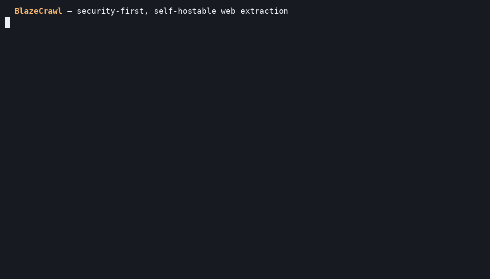
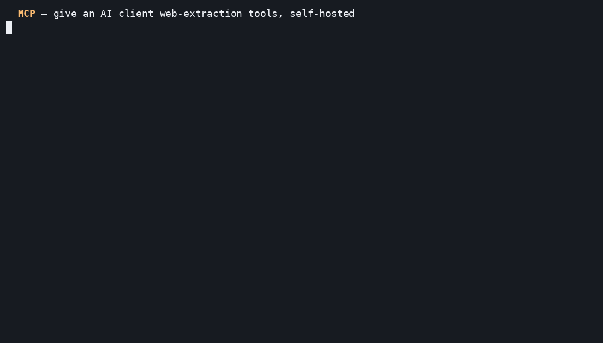
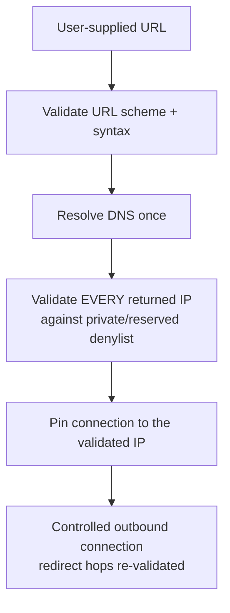
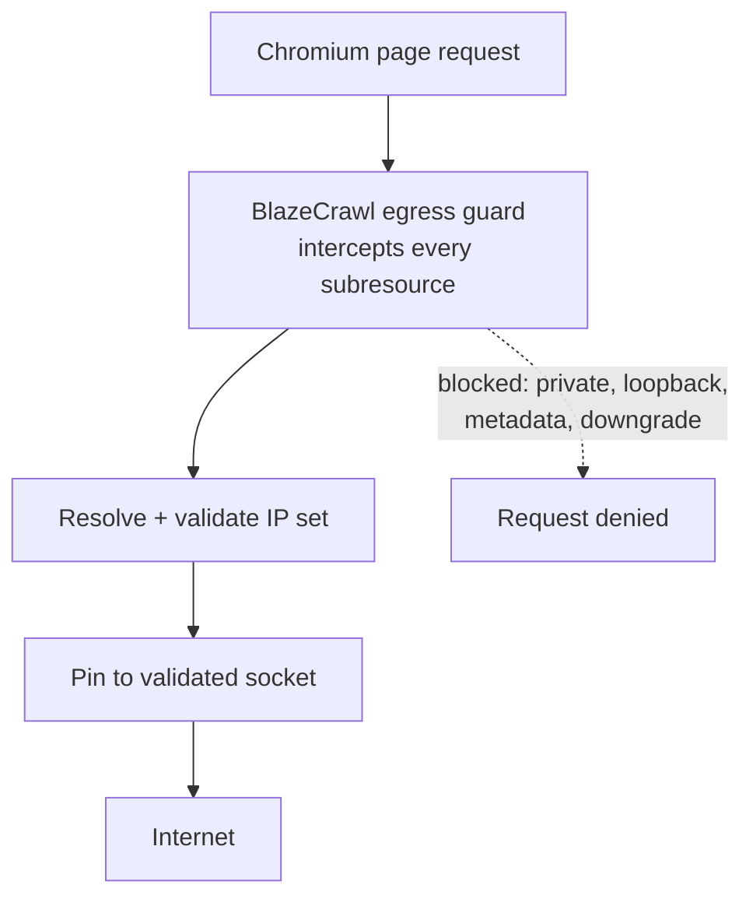

# BlazeCrawl Core

**Security-first, self-hostable web extraction for developers and AI systems.**
Turn web pages into clean, LLM-ready Markdown and structured data via three
endpoints: `/v1/scrape`, `/v1/crawl`, and `/v1/map`.

[](https://pypi.org/project/blazecrawl-core/)
[](https://www.npmjs.com/package/@blazecrawl/sdk)
[](https://github.com/danishxsethi/blazecrawl/actions/workflows/ci.yml)
[](https://pypi.org/project/blazecrawl-core/)
[](LICENSE)

<p align="center">
  
</p>

**Try it in one command** (published Linux x86_64 image):

```bash
docker run --rm -p 127.0.0.1:8000:8000 ghcr.io/danishxsethi/blazecrawl:0.1.2
```

Then scrape any URL → clean Markdown. Full walkthrough in [Quickstart](#quickstart).

BlazeCrawl Core is the **open-source engine**. It is built for people who want
to run their own scraping infrastructure **without handing their URLs, traffic,
or credentials to a third party** — and without giving up the outbound-request
security that most self-hosted scrapers skip.

## What it is

* A single-binary, self-hosted web-data API you run yourself.
* Hardened by default: every outbound fetch is **SSRF-validated and
  pinned-at-connect** (DNS-rebinding resistant), blocks private/loopback/
  link-local/cloud-metadata ranges, blocks `https→http` redirect downgrades,
  and caps response sizes.
* Browser-backed rendering (Playwright) for JS-heavy pages, with a fast static
  path for simple pages.
* robots.txt-respecting crawler (same-origin BFS).
* Python SDK, Node SDK, CLI, and MCP servers.

## What it is not

* **Not a hosted SaaS.** There is no account to create and no external service
  to sign up for. You run it; you own it.
* **Not a managed anti-bot / residential-proxy product.** Managed proxy fleets,
  managed LLM extraction, enterprise SSO/SCIM, and multi-tenant metering are
  part of the separate commercial *BlazeCrawl Cloud* — they are deliberately
  excluded here (see [docs/OSS_VS_CLOUD.md](docs/OSS_VS_CLOUD.md)).
* **Not a "Firecrawl killer".** It is a focused, security-first engine. No
  inflated benchmark claims — see [docs/BENCHMARKS.md](docs/BENCHMARKS.md) for
  our own reproducible baseline methodology.

## Why it exists

Most self-hosted scrapers treat the outbound request as trusted. BlazeCrawl
Core treats every user-supplied URL as hostile: it resolves the host once,
validates every returned address against a private/reserved denylist, pins the
connection to the validated IP (so DNS can't be rebound between check and use),
and re-validates every redirect hop. That posture is the point.

## Why BlazeCrawl?

* **Self-hosted.** Requests, URLs, and credentials stay on your machine. No
  account, no external service, no data leaves your infrastructure.
* **Security-oriented outbound networking.** Every fetch — static or browser —
  goes through one egress path that validates against SSRF, blocks
  private/reserved destinations, resists DNS rebinding (resolve-once +
  pin-at-connect), and intercepts browser subresource requests.
* **Many integration surfaces, one engine.** HTTP API, CLI, Python SDK, Node
  SDK, MCP server, and a Docker image — all backed by the same core.

Compared to wiring it up yourself:

| Capability | Raw `requests`/`httpx` | Raw Playwright | BlazeCrawl |
|---|:---:|:---:|:---:|
| Markdown extraction | manual | manual | built in |
| Site crawl (BFS + robots) | manual | manual | built in |
| Site map / URL discovery | manual | manual | built in |
| HTTP API | custom | custom | built in |
| JS browser rendering | no | yes | yes |
| Outbound SSRF / DNS-rebinding controls | manual | manual | built in |
| Python SDK | — | — | yes |
| Node SDK | — | — | yes |
| MCP server | — | — | yes |

This table compares *approaches*, not other products; it reflects what
BlazeCrawl provides out of the box versus assembling the pieces by hand.

## Quickstart

Two ways to run it. Both serve the API on `http://localhost:8000` (loopback
only) and generate a local API key on first start.

### Option A — published image (fastest)

```bash
docker run -d --name blazecrawl -p 127.0.0.1:8000:8000 \
  -v blazecrawl-data:/data/blazecrawl \
  ghcr.io/danishxsethi/blazecrawl:0.1.2

# grab the auto-generated local API key (shown once)
docker logs blazecrawl 2>&1 | grep "first run"
```

### Option B — Docker Compose from source

Prerequisites: Docker + Docker Compose.

```bash
git clone https://github.com/danishxsethi/blazecrawl.git
cd blazecrawl
docker compose up --build -d
docker compose logs api | grep "first run"
```

### Scrape

Use the key from the logs (`blz_local_...`):

```bash
curl -X POST http://localhost:8000/v1/scrape \
  -H "Authorization: Bearer blz_local_xxxxxxxx" \
  -H "Content-Type: application/json" \
  -d '{"url":"https://example.com"}'
```

The key is persisted to the data volume (mode `0600`) and reused on restart.

> **Stable keys:** set your own key and it will never be persisted or printed:
> `BLAZECRAWL_API_KEY=my-secret-key docker compose up`. To expose the API
> beyond loopback, change the published port deliberately and put TLS in front.

> **Trusted local development:** to skip the API key entirely, run bound to
> loopback with auth explicitly disabled:
> `BLAZECRAWL_AUTH_DISABLED=true BLAZECRAWL_HOST=127.0.0.1`.
> This is refused on any non-loopback bind.

## Local (no Docker)

```bash
pip install -e .
playwright install chromium
blazecrawl-server          # serves on http://127.0.0.1:8000
```

## API

| Endpoint | Description |
|---|---|
| `GET /health` | Liveness. |
| `GET /ready` | Readiness + browser-pool/cache/queue status. |
| `POST /v1/scrape` | Scrape a URL → Markdown/HTML/text/links/images. |
| `POST /v1/map` | Discover a site's URL set (sitemap + link graph). |
| `POST /v1/crawl` | Start a same-origin BFS crawl (async job). |
| `GET /v1/crawl/{id}` | Poll crawl status/results. |
| `DELETE /v1/crawl/{id}` | Cancel a crawl. |

### Scrape

```bash
curl -X POST http://localhost:8000/v1/scrape \
  -H "Authorization: Bearer $KEY" -H "Content-Type: application/json" \
  -d '{"url":"https://example.com","formats":["markdown","links"],"render":"auto"}'
```

`render` is `auto` (static, with browser fallback when content is thin),
`static`, or `browser`.

### Map

```bash
curl -X POST http://localhost:8000/v1/map \
  -H "Authorization: Bearer $KEY" -H "Content-Type: application/json" \
  -d '{"url":"https://example.com"}'
```

### Crawl

```bash
curl -X POST http://localhost:8000/v1/crawl \
  -H "Authorization: Bearer $KEY" -H "Content-Type: application/json" \
  -d '{"url":"https://example.com","max_pages":25,"max_depth":2}'
# → {"job_id":"...","status_url":"/v1/crawl/..."}
curl http://localhost:8000/v1/crawl/<job_id> -H "Authorization: Bearer $KEY"
```

<p align="center">
  
</p>

## Install SDKs and MCP integrations

All packages are published for v0.1.2 across PyPI, npm, and GHCR.

```bash
# Python server / CLI
pip install blazecrawl-core==0.1.2
playwright install chromium

# Python SDK or MCP server
pip install blazecrawl==0.1.2
pip install blazecrawl-mcp==0.1.2

# Node SDK or MCP server (Node 18+)
npm install @blazecrawl/sdk@0.1.2
npm install @blazecrawl/mcp@0.1.2
```

`blazecrawl-core` starts the self-hosted server and provides the CLI.
`blazecrawl` and `@blazecrawl/sdk` are API clients. The `*-mcp` packages expose
BlazeCrawl tools to MCP-compatible clients over stdio.

## SDKs & CLI

**Python**

```python
from blazecrawl import BlazeCrawl

with BlazeCrawl(api_key="blz_local_...") as bc:
    print(bc.scrape("https://example.com")["markdown"])
```

**Node**

```js
import { BlazeCrawl } from "@blazecrawl/sdk";
const doc = await new BlazeCrawl({ apiKey: "blz_local_..." }).scrape("https://example.com");
console.log(doc.markdown);
```

**CLI**

```bash
export BLAZECRAWL_API_KEY=blz_local_...
blazecrawl scrape https://example.com
blazecrawl scrape https://example.com --output page.md
blazecrawl map https://example.com
blazecrawl crawl https://example.com --max-pages 25 --wait
```

Use `scrape --output PATH` to save the result as UTF-8 instead of printing it.
It uses the same format as stdout: Markdown when available, otherwise JSON.
Combine with `--json` to save the full JSON response. The parent directory must
exist; a successful response overwrites the destination file. API errors are
printed to stderr without modifying the destination, and file-write errors
return a nonzero exit status.

**MCP** — give an MCP-compatible AI client web-extraction tools while the
crawler stays self-hosted on your machine:

```json
{
  "mcpServers": {
    "blazecrawl": {
      "command": "blazecrawl-mcp",
      "env": { "BLAZECRAWL_API_KEY": "blz_local_..." }
    }
  }
}
```

This generic config works with any MCP client that launches stdio servers. The
`blazecrawl-mcp` command comes from `pip install blazecrawl-mcp` (Python) or
`npx @blazecrawl/mcp` (Node) — see [mcp/python](mcp/python/README.md) and
[mcp/node](mcp/node/README.md).

<p align="center">
  
</p>

More runnable snippets live in [examples/](examples/README.md).

## Architecture

```
        ┌────────────────────────────────────────────┐
 SDK ──▶│  FastAPI  /v1/scrape  /v1/map  /v1/crawl   │
 CLI ──▶│                                            │
 MCP ──▶│  auth (local key)                          │
        └───────┬────────────────────────────────────┘
                │
     ┌──────────▼───────────┐     ┌──────────────────────────┐
     │  network/egress      │     │  engine                  │
     │  • SSRF validate+pin │────▶│  • content extraction    │
     │  • manual redirects  │     │    (readability/trafil.) │
     │  • private-IP block  │     │  • HTML → Markdown       │
     │  • browser req guard │     │  • browser pool (Playwright)
     └──────────────────────┘     │  • crawler (BFS + robots)│
                                   │  • cache (memory|redis)  │
                                   └──────────────────────────┘
```

Full details in [docs/ARCHITECTURE.md](docs/ARCHITECTURE.md).

## Security model

BlazeCrawl Core is designed to be safe to point at arbitrary URLs. Every
outbound request — whether a fast static fetch or a full browser render — is
forced through a single egress path that validates the destination *before* any
bytes are sent.

<p align="center">
  
</p>

**Static path** (default for simple pages):



**Browser path** (JS-heavy pages): Chromium never talks to the network
directly. Every subresource request is intercepted and routed through the same
controls:



Highlights:

* DNS-rebinding-resistant egress (resolve-once + pin-at-connect).
* Private/loopback/link-local/cloud-metadata/IPv4-mapped-IPv6 blocked.
* `https→http` redirect downgrades blocked; redirect hops re-validated.
* Response size caps; per-hop timeouts; browser request interception guard.
* robots.txt enforced and not configurable-off in the OSS core.

See [SECURITY.md](SECURITY.md) for the disclosure policy and
[docs/SECURITY_MODEL.md](docs/SECURITY_MODEL.md) for the full model.

## Maturity

`v0.1.x` — early release. The scrape/map/crawl engine, egress security, SDKs,
CLI and MCP are functional and tested. This is **not yet** battle-hardened at
large scale; please report issues. See [CHANGELOG.md](CHANGELOG.md) and the
[roadmap](docs/ROADMAP.md).

## Contributing

We welcome contributions — see [CONTRIBUTING.md](CONTRIBUTING.md) and the
good-first-issue backlog in [docs/CONTRIBUTION_BACKLOG.md](docs/CONTRIBUTION_BACKLOG.md).

## License

Apache-2.0 — see [LICENSE](LICENSE).
