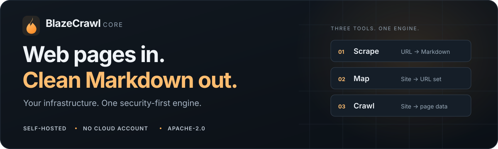
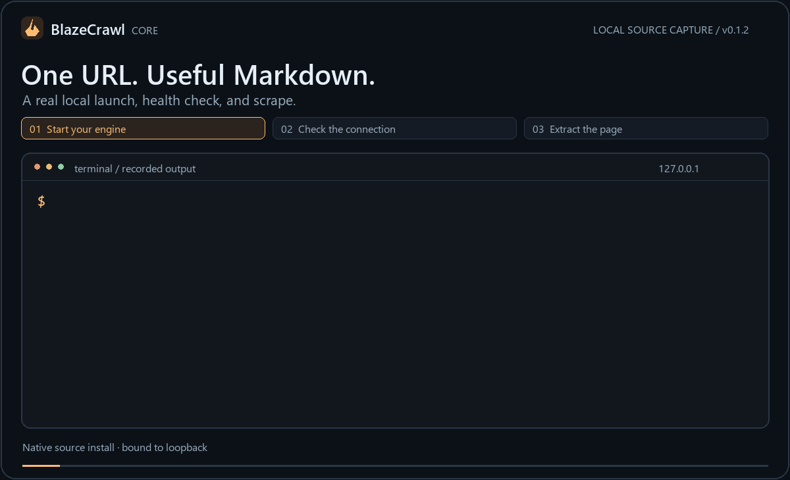
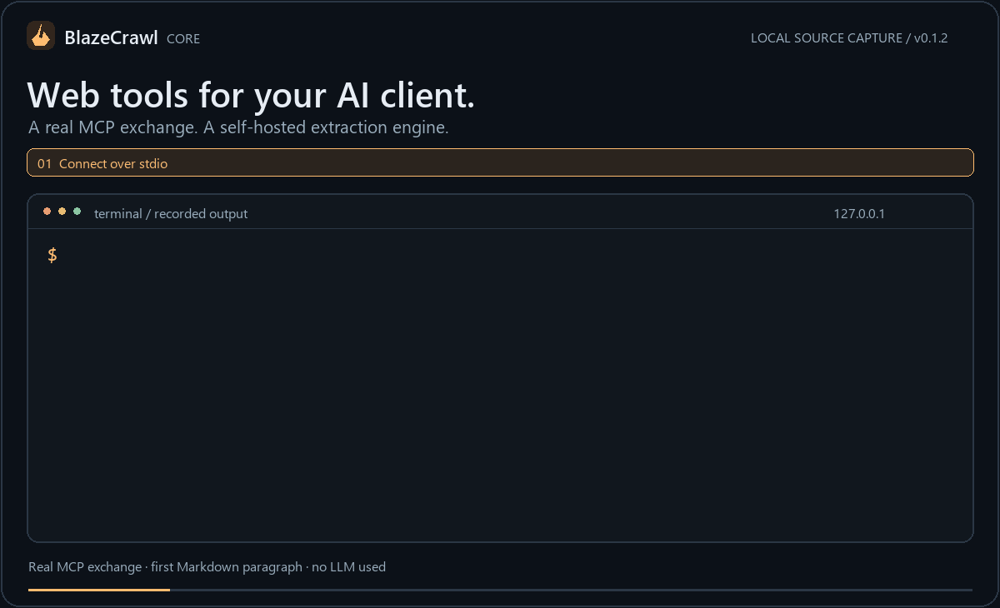
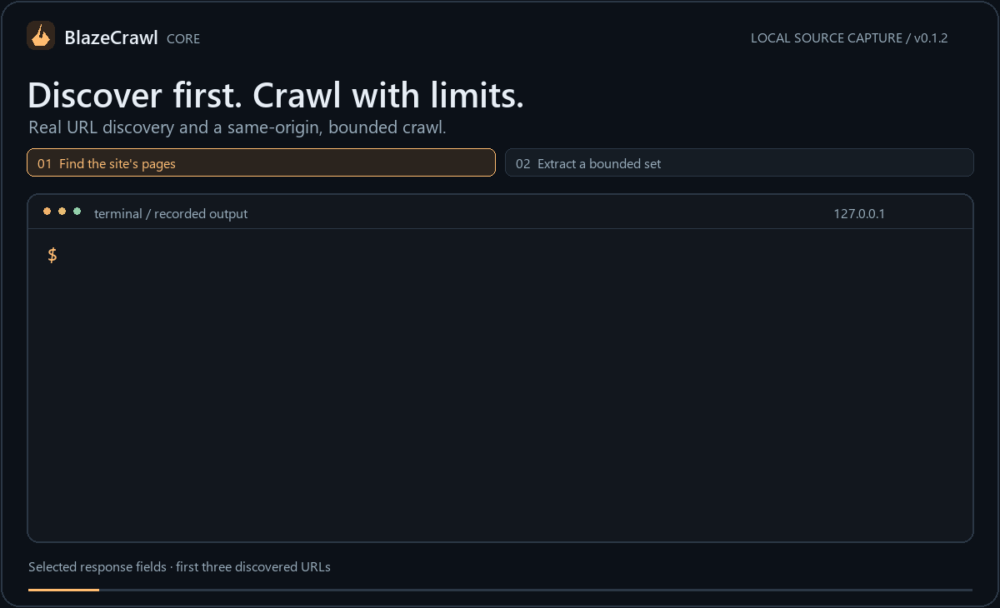
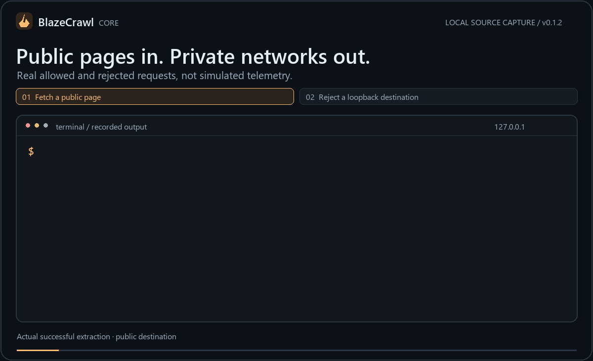

<p align="center">
  
</p>

<h1 align="center">BlazeCrawl Core</h1>

<p align="center">
  <strong>Security-first web extraction. Self-hosted by you.</strong><br />
  Turn public web pages into Markdown and page data for RAG pipelines, AI agents, and developer tools.
</p>

<p align="center">
  <a href="https://pypi.org/project/blazecrawl-core/"></a>
  <a href="https://www.npmjs.com/package/@blazecrawl/sdk"></a>
  <a href="https://github.com/danishxsethi/blazecrawl/actions/workflows/ci.yml"></a>
  <a href="https://pypi.org/project/blazecrawl-core/"></a>
  <a href="LICENSE"></a>
</p>

<p align="center">
  <a href="#quickstart"><strong>Get started</strong></a> &nbsp;·&nbsp;
  <a href="#integrations">Choose an integration</a> &nbsp;·&nbsp;
  <a href="#contributing"><strong>Build with us</strong></a> &nbsp;·&nbsp;
  <a href="docs/ARCHITECTURE.md">Explore the architecture</a>
</p>

---

**One engine. Three jobs:** scrape a page, map a site's URLs, or crawl a bounded set of pages.
Run it locally without a cloud account or a third-party scraping service.

<p align="center">
  
</p>

<p align="center">
  <sub>Real output from a native local instance. No simulated results. <a href="docs/assets/blazecrawl-hero.png">Static view</a> · <a href="scripts/readme_demo/README.md">Reproduce the demos</a></sub>
</p>

## Why BlazeCrawl?

Web extraction is more than fetching HTML. BlazeCrawl brings the API, rendering, extraction,
and outbound-request controls together so you can spend less time assembling infrastructure.

| What you need | What BlazeCrawl provides |
|---|---|
| Content for your retrieval pipeline | Main-content extraction to Markdown, with optional HTML, text, links, and images. |
| A site's discoverable URLs | Sitemap and link-graph discovery through `/v1/map`. |
| More than one page | Same-origin crawl jobs with page/depth limits, robots.txt rules, polling, and cancellation. |
| JavaScript-rendered content | Playwright rendering, plus a static path and automatic fallback for thin content. |
| Control over your deployment | A local API and Docker image; no mandatory hosted platform or cloud credentials. |
| Defenses against hostile URLs | Destination validation, private-address blocking, DNS-rebinding-resistant connections, and guarded browser egress. |
| A familiar integration | HTTP, Python, Node.js, CLI, or MCP, backed by the same engine. |

**Best fit:** self-hosted extraction for developer tools, research workflows, and downstream AI systems.
Core does not bundle an LLM, a managed proxy fleet, or a promise to bypass every site's bot protection.

## Quickstart

**Prerequisite:** Docker running Linux containers. The published `v0.1.2` image targets **Linux x86_64**;
other architectures may need emulation or a source build. Shell examples below use Bash; a PowerShell
version follows. Prefer Python? Use the [no-Docker option](#local-no-docker).

### 1. Start the API

```bash
docker run -d --name blazecrawl \
  -p 127.0.0.1:8000:8000 \
  -v blazecrawl-data:/data/blazecrawl \
  ghcr.io/danishxsethi/blazecrawl:0.1.2
```

The API is published to loopback only. The volume keeps your generated key across container restarts.

### 2. Get your local key

```bash
docker logs -f blazecrawl
```

Wait for the `first run` line, copy the `blz_local_...` key, then press **Ctrl+C** to stop following
the logs; the container keeps running. The key is shown only when first generated. Keep it private.
If you reuse an existing volume, use your previously saved key instead.

### 3. Make your first request

```bash
export BLAZECRAWL_API_URL="http://127.0.0.1:8000"
export BLAZECRAWL_API_KEY="blz_local_REPLACE_WITH_YOUR_KEY"

curl -fsS "$BLAZECRAWL_API_URL/ready"

curl -fsS "$BLAZECRAWL_API_URL/v1/scrape" \
  -H "Authorization: Bearer $BLAZECRAWL_API_KEY" \
  -H "Content-Type: application/json" \
  -d '{"url":"https://example.com","formats":["markdown"],"render":"static"}'
```

The JSON response contains `success` and `data`; your extracted Markdown is at **`data.markdown`**.
The SDKs unwrap `data` for you. Check `browser.is_healthy` in `/ready` before using browser rendering;
static extraction can still work when the browser pool is unavailable.

Open **[interactive API docs](http://127.0.0.1:8000/docs)** on your running instance to explore the contract.

<details>
<summary><strong>PowerShell quickstart</strong></summary>

```powershell
docker run -d --name blazecrawl -p 127.0.0.1:8000:8000 -v blazecrawl-data:/data/blazecrawl ghcr.io/danishxsethi/blazecrawl:0.1.2
docker logs -f blazecrawl
```

Copy the first-run key and press Ctrl+C, then:

```powershell
$env:BLAZECRAWL_API_URL = "http://127.0.0.1:8000"
$env:BLAZECRAWL_API_KEY = "blz_local_REPLACE_WITH_YOUR_KEY"
Invoke-RestMethod "$env:BLAZECRAWL_API_URL/ready"

$headers = @{ Authorization = "Bearer $env:BLAZECRAWL_API_KEY" }
$body = @{ url = "https://example.com"; formats = @("markdown"); render = "static" } | ConvertTo-Json
$result = Invoke-RestMethod -Uri "$env:BLAZECRAWL_API_URL/v1/scrape" -Method Post -Headers $headers -ContentType "application/json" -Body $body
$result.data.markdown
```

</details>

<details>
<summary><strong>Build from source with Docker Compose</strong></summary>

```bash
git clone https://github.com/danishxsethi/blazecrawl.git
cd blazecrawl
docker compose up --build -d
docker compose logs -f api
```

Copy the first-run key, stop following logs, and use the same requests above.
Compose also includes an optional Redis service for caching; crawl jobs remain in process.

</details>

**Deployment note:** set `BLAZECRAWL_API_KEY` yourself to use a key that is never printed or persisted.
Keep authentication enabled. Publishing beyond loopback requires deliberate access controls and TLS.
See the [security model](docs/SECURITY_MODEL.md) before exposing the API.

### Local (no Docker)

Requires **Python 3.11+**. On native Windows, set an explicit `BLAZECRAWL_API_KEY` before starting
the server; generated-key storage expects POSIX file permissions. Use the same securely generated
value in both server and client terminals:

```powershell
$env:BLAZECRAWL_API_KEY = "blz_local_REPLACE_WITH_A_RANDOM_SECRET"
```

Install into a virtual environment:

```bash
pip install blazecrawl-core==0.1.2
playwright install chromium
blazecrawl-server
```

On Linux, `playwright install --with-deps chromium` also installs the browser's OS dependencies.
The server defaults to `http://127.0.0.1:8000`. If you did not supply your own key, copy the first-run
key; then make the same authenticated request from another terminal. The CLI is included in `blazecrawl-core`.

## Integrations

All clients below connect to **your running BlazeCrawl API**. They do not start a server.
Keep `BLAZECRAWL_API_URL` and `BLAZECRAWL_API_KEY` from the quickstart in your environment.

| Surface | Install | Detailed guide |
|---|---|---|
| Server + CLI | `pip install blazecrawl-core==0.1.2` | [Quickstart](#quickstart) |
| Python SDK | `pip install blazecrawl==0.1.2` | [Python SDK](sdks/python/README.md) |
| Node.js SDK, Node 18+ | `npm install @blazecrawl/sdk@0.1.2` | [Node SDK](sdks/node/README.md) |
| Python MCP server | `pip install blazecrawl-mcp==0.1.2` | [Python MCP](mcp/python/README.md) |
| Node.js MCP server, Node 18+ | `npm install @blazecrawl/mcp@0.1.2` | [Node MCP](mcp/node/README.md) |

### Python

```python
from blazecrawl import BlazeCrawl

with BlazeCrawl() as client:  # Uses your environment variables.
    document = client.scrape("https://example.com", render="static")
    print(document["markdown"])
```

### Node.js

Use an ES module, such as `scrape.mjs`:

```javascript
import { BlazeCrawl } from "@blazecrawl/sdk";

const client = new BlazeCrawl(); // Uses your environment variables.
const document = await client.scrape("https://example.com", { render: "static" });
console.log(document.markdown);
```

### CLI

```bash
blazecrawl scrape https://example.com --render static
blazecrawl map https://quotes.toscrape.com
blazecrawl crawl https://quotes.toscrape.com --max-pages 3 --max-depth 1 --wait
blazecrawl health
```

Add `--json` for the full response. See [runnable examples](examples/README.md) for more.

**Source-checkout extras:** `scrape --output page.md` and `doctor` are available in the current
repository, **not the published `v0.1.2` CLI**. Follow [source setup](CONTRIBUTING.md#setup) to use them.
`--output` writes UTF-8 and overwrites an existing file; its parent directory must exist.
`doctor` checks Chromium and, when configured, server/key access.

### MCP

Give an MCP-compatible client `scrape`, `map`, and `crawl` tools over stdio while the extraction
engine stays self-hosted. After installing `blazecrawl-mcp`, add:

```json
{
  "mcpServers": {
    "blazecrawl": {
      "command": "blazecrawl-mcp",
      "env": {
        "BLAZECRAWL_API_URL": "http://127.0.0.1:8000",
        "BLAZECRAWL_API_KEY": "blz_local_REPLACE_WITH_YOUR_KEY"
      }
    }
  }
}
```

Replace the placeholder with your local key. Your client must be able to find the installed command.
Prefer Node.js? See the [equivalent `npx` configuration](mcp/node/README.md).

<details>
<summary><strong>Watch a real MCP tool call</strong></summary>

<p align="center">
  
</p>

[Static view](docs/assets/blazecrawl-mcp.png). This is a protocol demonstration, not a simulated AI conversation.

</details>

## API

| Endpoint | Purpose |
|---|---|
| `GET /health` | Liveness, version, and runtime mode. |
| `GET /ready` | Browser-pool, cache, and queue status. |
| `POST /v1/scrape` | One page to Markdown, HTML, text, links, or images. |
| `POST /v1/map` | Discover URLs from sitemaps and the link graph. |
| `POST /v1/crawl` | Start an asynchronous, same-origin crawl. |
| `GET /v1/crawl/{job_id}` | Poll status and collected page data. |
| `DELETE /v1/crawl/{job_id}` | Cancel a crawl. |

All `/v1/` endpoints require your bearer key by default. Scrape `render` accepts `static`, `browser`,
or `auto` (static first, browser fallback for thin content). See [table conversion limits](docs/MARKDOWN_TABLES.md)
when working with tabular pages. The current source checkout also supports `user_agent` per scrape
or crawl; it selects robots.txt rules for crawls. That field is **not in the published `v0.1.2` schema**.
Your running instance's `/docs` is the authoritative version-specific contract.

<details>
<summary><strong>Map and crawl over HTTP, with a real walkthrough</strong></summary>

```bash
curl -fsS "$BLAZECRAWL_API_URL/v1/map" \
  -H "Authorization: Bearer $BLAZECRAWL_API_KEY" \
  -H "Content-Type: application/json" \
  -d '{"url":"https://quotes.toscrape.com"}'

curl -fsS "$BLAZECRAWL_API_URL/v1/crawl" \
  -H "Authorization: Bearer $BLAZECRAWL_API_KEY" \
  -H "Content-Type: application/json" \
  -d '{"url":"https://quotes.toscrape.com","max_pages":3,"max_depth":1}'

# Replace JOB_ID with the job_id from the crawl response.
curl -fsS "$BLAZECRAWL_API_URL/v1/crawl/JOB_ID" \
  -H "Authorization: Bearer $BLAZECRAWL_API_KEY"
```

Starting a crawl returns HTTP `202` with `job_id` and `status_url`.
Poll until `status` is `completed`, `failed`, or `cancelled`; inspect `pages_failed` as well.

<p align="center">
  
</p>

[Static view](docs/assets/blazecrawl-map-crawl.png). Counts shown are from the recorded run, not a performance guarantee.

</details>

## Security model

**User-supplied URLs are untrusted input.** Static HTTP validates destinations and pins connections
to approved addresses. Browser traffic passes through a validating loopback egress proxy, with
request guards for redirects, subresources, and unsupported browser primitives.

| Boundary | Controls |
|---|---|
| Destinations | Private, loopback, link-local, reserved, and cloud-metadata addresses are blocked. |
| DNS and redirects | Validate the complete resolved address set, pin connections, revalidate redirect hops, and block HTTPS-to-HTTP downgrades. |
| Browser egress | Govern HTTP/HTTPS socket destinations; block WebSockets, workers, and service workers. |
| Resource use | Response-size caps, timeouts, and bounded crawl requests. |
| Local access | Bearer authentication by default; loopback-only port publishing in the quickstart. |

<details>
<summary><strong>See a real blocked request</strong></summary>

<p align="center">
  
</p>

[Static view](docs/assets/blazecrawl-security.png). The demo shows actual responses, not packet-level telemetry.

</details>

Egress controls are **not a substitute for workload isolation**. Use appropriate containers/VMs for
untrusted crawling, keep authentication enabled, and respect site policies and applicable law.
Read the [full threat model](docs/SECURITY_MODEL.md); report vulnerabilities through [SECURITY.md](SECURITY.md).

## Architecture

```text
HTTP / Python / Node.js / CLI / MCP
                |
        FastAPI + local auth
                |
       Scrape / Map / Crawl
                |
    Validated egress + browser proxy
                |
         Public web content
                |
      Extraction -> Markdown / data
```

The default is a **single-node Python service** with an in-process crawl manager and memory cache.
Redis caching is optional; a distributed/persistent crawl queue is not implemented in this release.
Explore [the architecture](docs/ARCHITECTURE.md) and [the roadmap](docs/ROADMAP.md) before proposing extensions.

## Contributing

**Help make self-hosted web extraction easier to trust and easier to use.**
You do not need to start with networking internals: a reproducible bug report, a tricky extraction
fixture, a useful example, or a clearer explanation can make a meaningful contribution.

**[Find a good first issue](https://github.com/danishxsethi/blazecrawl/issues?q=is%3Aissue%20is%3Aopen%20label%3A%22good%20first%20issue%22)** ·
**[Browse help wanted](https://github.com/danishxsethi/blazecrawl/issues?q=is%3Aissue%20is%3Aopen%20label%3A%22help%20wanted%22)** ·
**[Propose an improvement](https://github.com/danishxsethi/blazecrawl/issues/new/choose)**

1. Choose an open issue or discuss a focused change before building something substantial.
2. Follow [CONTRIBUTING.md](CONTRIBUTING.md) for setup, tests, and the first-PR workflow.
3. Include a reproduction or relevant tests, and explain the user-facing difference in your PR.

The [contribution backlog](docs/CONTRIBUTION_BACKLOG.md) offers ideas and context; some items are
already complete, so check the live tracker before claiming one. All user-controlled network access
must stay within the existing egress controls, including the browser proxy.

Built with help from [our contributors](https://github.com/danishxsethi/blazecrawl/graphs/contributors).
Participation follows the [Code of Conduct](CODE_OF_CONDUCT.md); project roles are described in [Governance](GOVERNANCE.md).

## Project status and support

**v0.1.x: an early release, not a large-scale production guarantee.** The core surfaces are implemented;
real-world feedback, compatibility reports, and regression tests are especially useful.

Core is the open-source engine, not a hosted SaaS. Managed anti-bot/proxy services, managed LLM execution,
enterprise identity, billing, and multi-tenant metering are outside this repository's scope.
See [OSS vs. Cloud](docs/OSS_VS_CLOUD.md). Performance figures are limited to the
[documented baseline and its caveats](docs/BENCHMARKS.md), not competitor comparisons.

| Need | Go here |
|---|---|
| Bug report or feature request | [Issue templates](https://github.com/danishxsethi/blazecrawl/issues/new/choose) |
| Setup question | [Support guide](SUPPORT.md) and a focused GitHub issue |
| Release notes | [Releases](https://github.com/danishxsethi/blazecrawl/releases) · [Changelog](CHANGELOG.md) |
| Planned work | [Roadmap](docs/ROADMAP.md) |
| Security disclosure | [Security policy](SECURITY.md) |

GitHub Discussions is not enabled; GitHub issues are the current public support channel.
If BlazeCrawl is useful to you, star the repository to help others discover it, and watch releases for updates.

## License

**Apache-2.0.** Use it, self-host it, and build on it. See [LICENSE](LICENSE) and [NOTICE](NOTICE).
